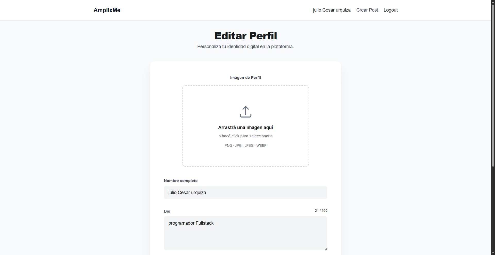
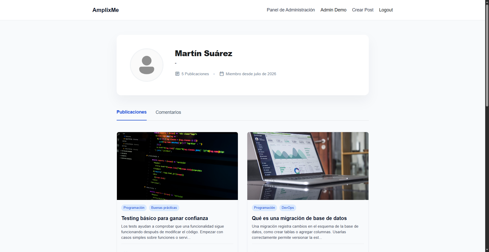
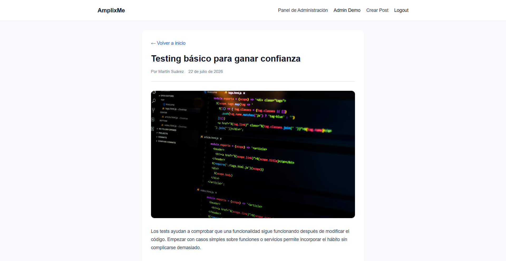
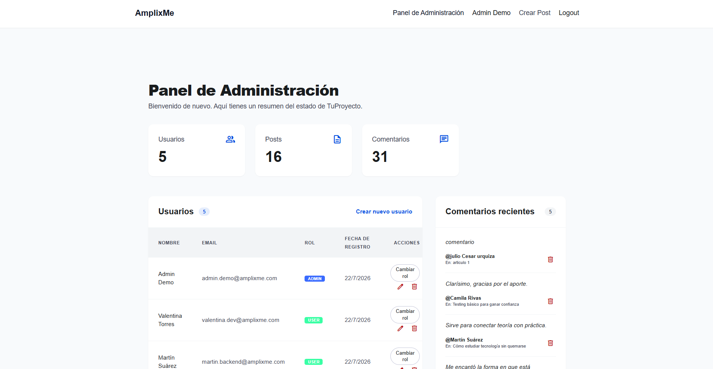
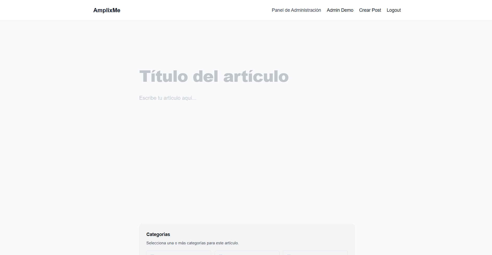
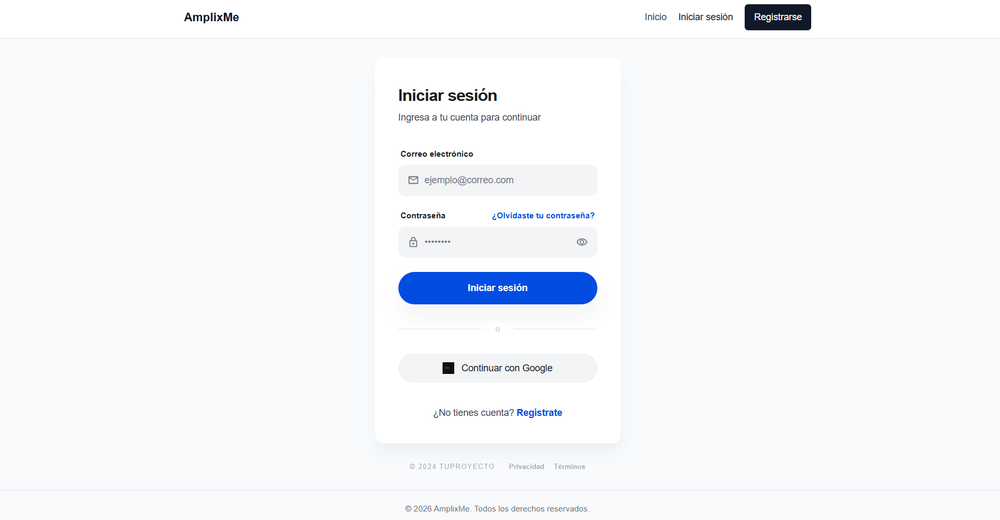
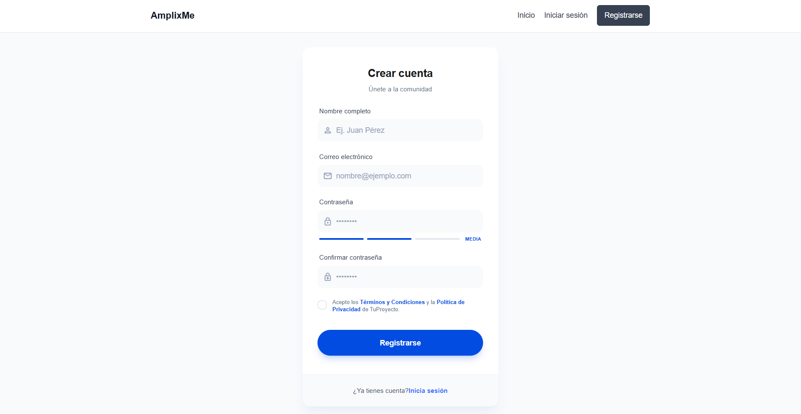
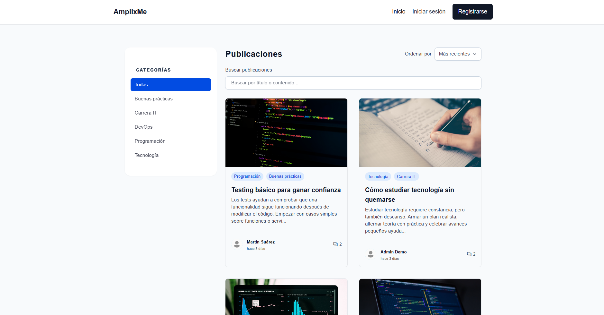

# FS-0007

Proyecto para el programa Amplix Acceleration Program.

## Descripción

Este repositorio contiene una aplicación fullstack en JavaScript con backend y frontend separados. El backend usa Node.js, Express y Prisma para conectarse a la base de datos. El frontend usa un framework moderno de JavaScript con Vite usando React para consumir la API.

La aplicación sirve para gestionar contenido en un blog o portal de noticias: permite registrarse, iniciar sesión, crear y editar publicaciones, subir imágenes, comentar, filtrar por categorías y administrar usuarios y contenido desde un panel administrativo.

## Tech stack

- Backend: Node.js, Express, Prisma, PostgreSQL (u otra base de datos compatible)
- Frontend: Vite, JavaScript, React
- Herramientas: npm, Git

## Screenshots

### Editar perfil

### Perfil de usuario

### Detalle de publicación

### Panel de administración

### Crear publicación

### Iniciar sesión

### Registrarse

### Listado de publicaciones

## Instrucciones de setup

1. Clonar el repositorio
   - `git clone <url-del-repositorio>`
   - `cd FS-0007`

2. Instalar dependencias
   - En la carpeta raíz o en las subcarpetas según el proyecto:
     - `npm install`
     - Si hay carpetas `backend` y `frontend`, ejecutar:
       - `cd backend && npm install`
       - `cd ../frontend && npm install`

3. Configurar variables de entorno
   - Copiar el archivo de ejemplo a `.env` en cada carpeta necesaria.
   - Backend:
     - `cd backend`
     - `cp .env.example .env`
     - Abrir `.env` y configurar:
       - `DATABASE_URL`
       - `JWT_SECRET`
       - `PORT`
       - `JWT_EXPIRES_IN`
       - `CLOUDINARY_URL`
       - `CORS_ORIGIN`
   - Frontend:
     - `cd ../frontend`
     - `cp .env.example .env`
     - Abrir `.env` y configurar:
       - `VITE_API_URL`
   - Si no estás en un sistema con `cp`, crea el archivo manualmente.

4. Correr migraciones de la base de datos (backend)
   - Desde `backend`:
     - `npx prisma migrate dev`
   - Si necesitas reiniciar la base de datos de desarrollo:
     - `npx prisma migrate reset`

5. Generar cliente de Prisma
   - Desde `backend`:
     - `npx prisma generate`

6. Iniciar servidores
   - Backend:
     - `cd backend`
     - `npm run dev`
   - Frontend:
     - `cd frontend`
     - `npm run dev`

7. Acceder a la aplicación
   - Abrir el navegador en la URL indicada por el servidor frontend, normalmente `http://localhost:5173`.

## Notas adicionales

- Asegúrate de que la base de datos está en funcionamiento antes de ejecutar las migraciones.
- Si nunca has usado estas tecnologías, usa un editor de texto para editar el archivo `.env` y verifica que las rutas y puertos coincidan con tu configuración local.

---

## Url publica de backend

- https://fs-0007.onrender.com/

## Url publica de frontend

- https://fs-0007.vercel.app/

## Documentación de la API

La API cuenta con documentación interactiva construida con Swagger.

Para ver y probar todos los endpoints(incluyendo autenticación con Token JWT):

1. Inicia el servidor del backend (`npm run dev`).
2. Abrí tu navegador e ingresá a: `http://localhost:3000/api-docs`
